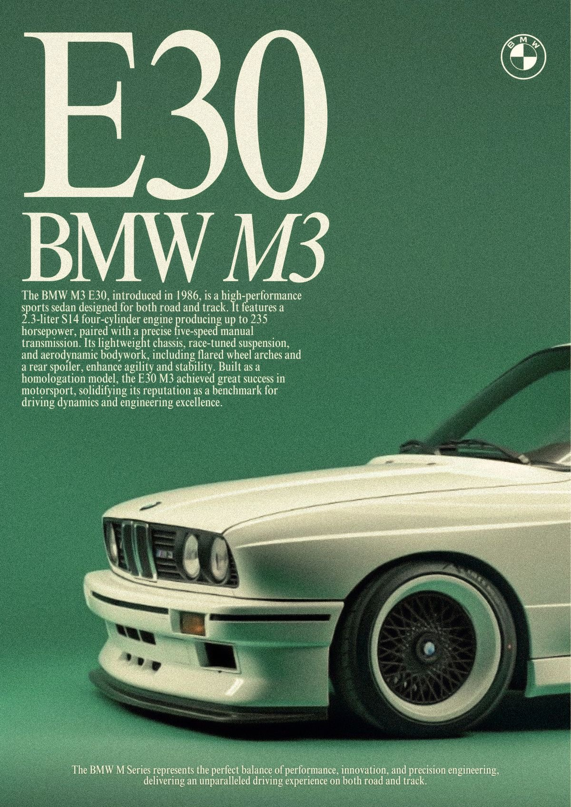
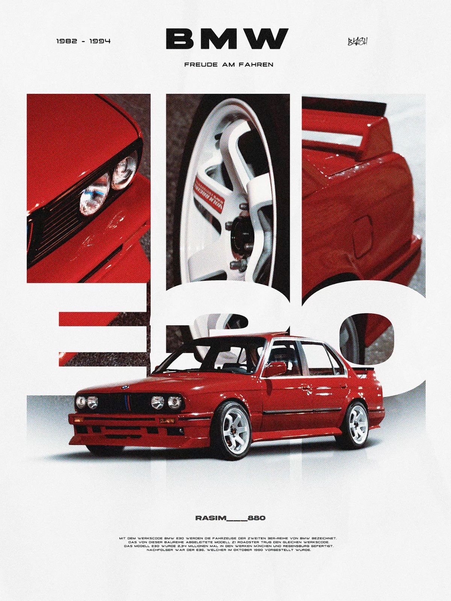
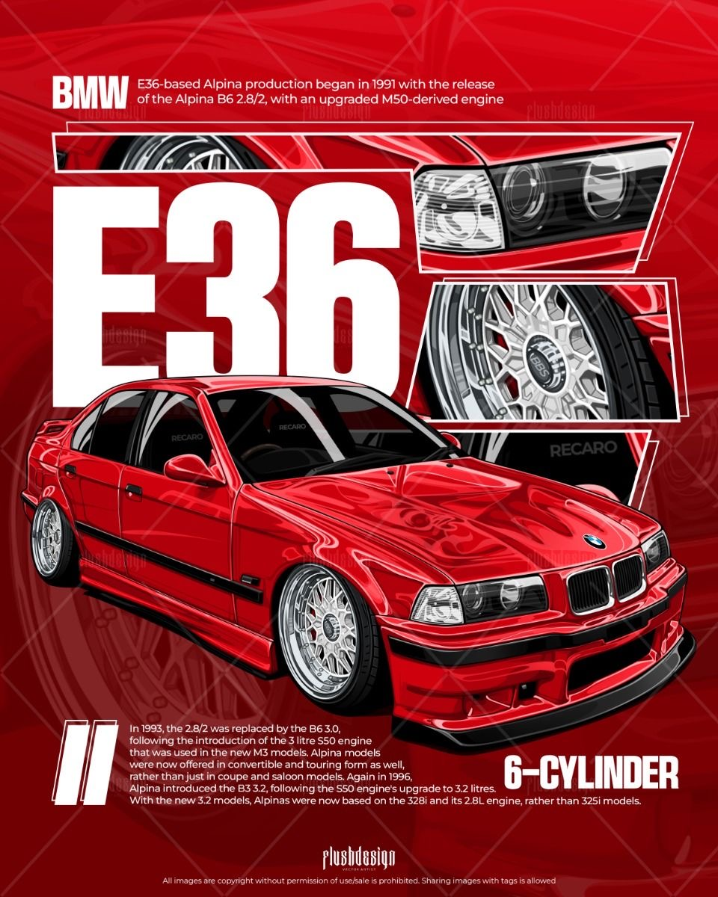
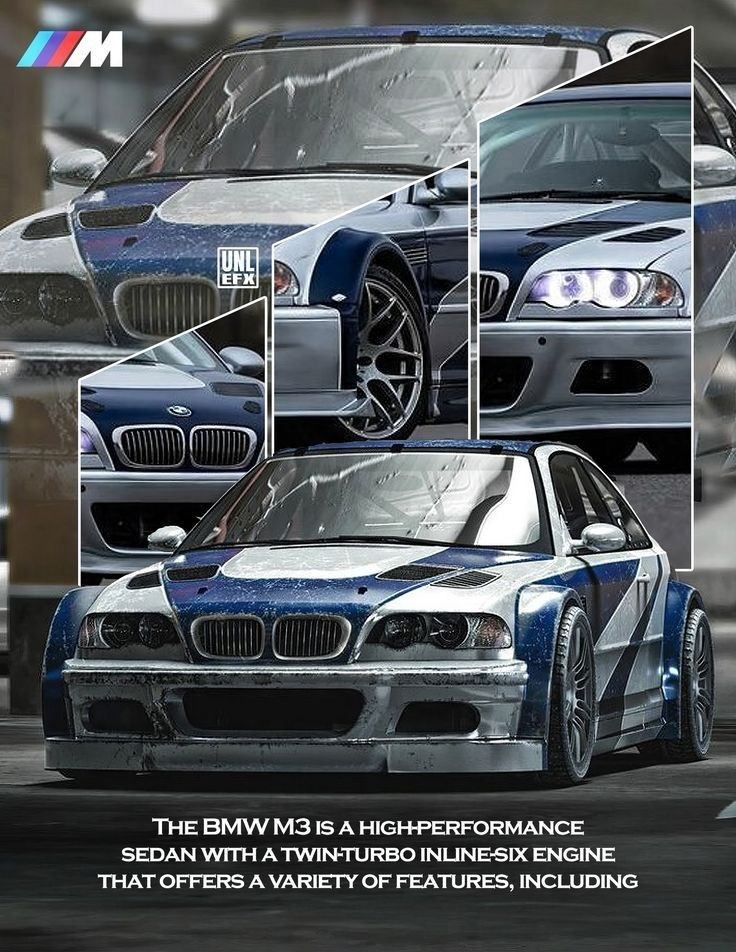
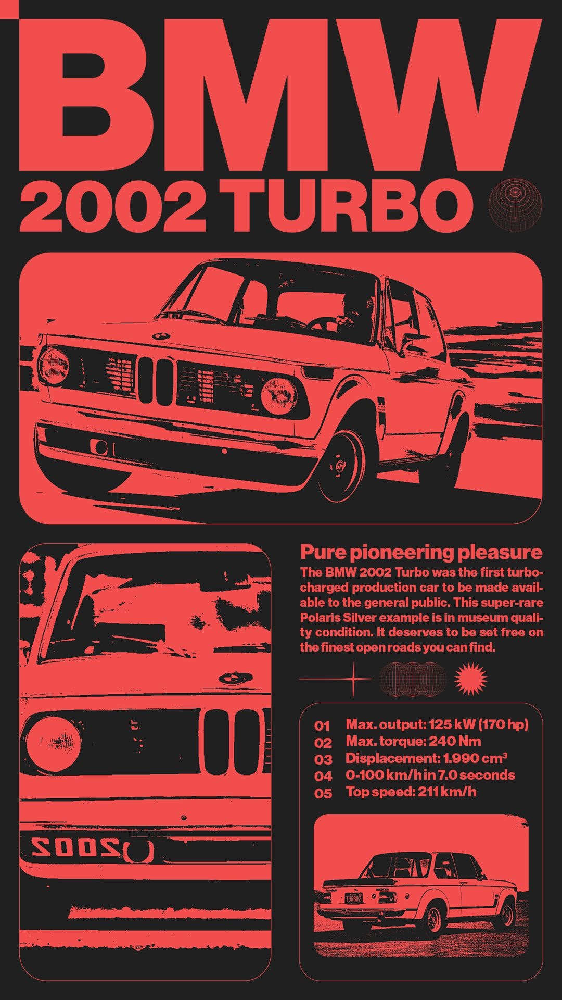
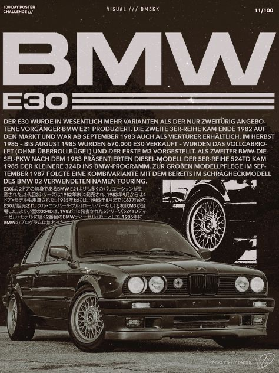
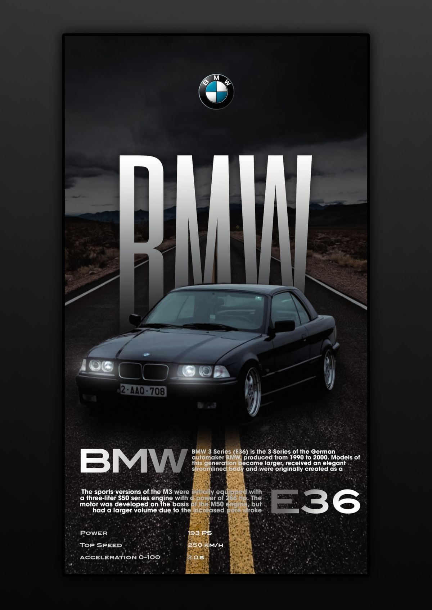
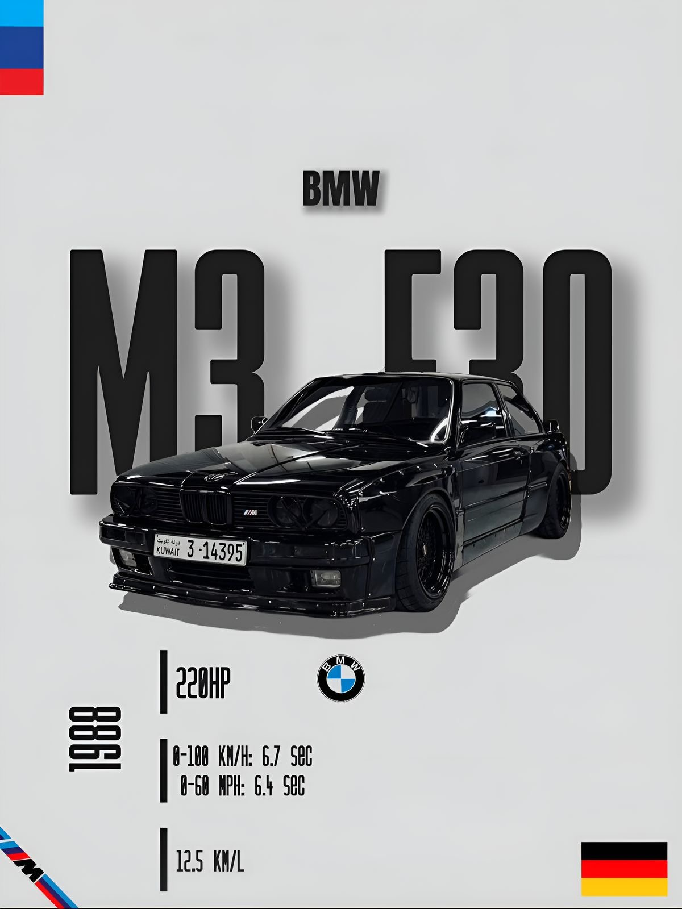

# Carousels-Effect
Infinite Carousel Effect using CSS and HTML

<!DOCTYPE html>
<html lang="en">
<head>
    <meta charset="UTF-8">
    <meta name="viewport" content="width=device-width, initial-scale=1.0">
    <title>Document</title>
    <link rel="stylesheet" href="3D_slider.css">
    <link href="https://fonts.cdnfonts.com/css/ica-rubrik-black" rel="stylesheet">
    <link href="https://fonts.cdnfonts.com/css/poppins" rel="stylesheet">

</head>
<body>
    

        

            

            

            

            

            

            

            

            

            

            

            

            

        

        

            <h1 data-content="BMW Classics">BMW Classics</h1>
            

                
By Lenin

                
Created using only HTML & CSS.

            

        

        

    
    

</body>
</html>

